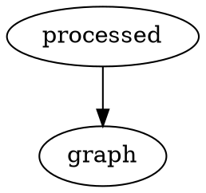

# Chapter 1

```bob
    0       3
     *-------*      +y
  1 /|    2 /|       ^
   *-------* |       |
   | |4    | |7      | ◄╮
   | *-----|-*     ⤹ +-----> +x
   |/      |/       / ⤴
   *-------*       v
  5       6      +z
```





